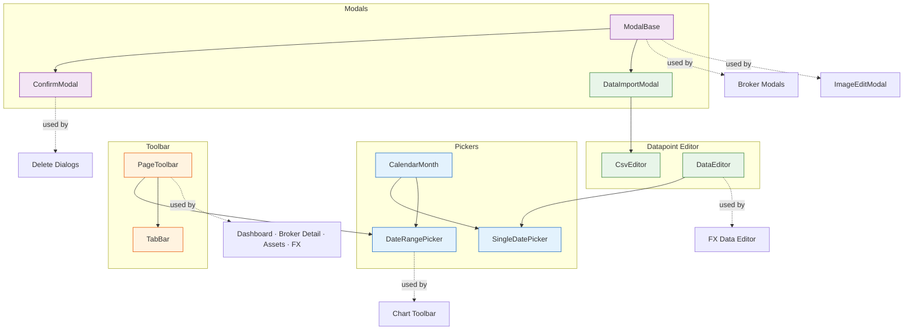

# 🧱 Core UI Components

Generic, reusable components in `lib/components/ui/` that serve as building blocks for all composite components.

## 🗺️ Dependency Map

## 📑 Sub-sections

| Section | Components | Description |
|---------|-----------|-------------|
| **[Modals](modals.md)** | ModalBase, ConfirmModal | Foundation for all modal dialogs |
| **[Feedback](feedback.md)** | ToastContainer, InfoBanner, LoadingSpinner, Tooltip | Notifications and user feedback |
| **[Pickers](datePickers.md)** | CalendarMonth, SingleDatePicker, DateRangePicker | Date selection components |
| **[Toolbar & Responsive Layout](toolbar.md)** | PageToolbar, TabBar, `responsiveLayout.svelte.ts` | Container-width-driven responsive page toolbar shell |
| **[Atoms](atoms.md)** | ThemeToggle, DocsLink, AnimatedBackground, OrderableList, PasswordInput, PasswordStrength | Small standalone UI primitives |
| **[Datapoint Editor](data-editor.md)** | DataEditor, CsvEditor, DataImportModal | Inline editing and CSV import for financial datapoints |
