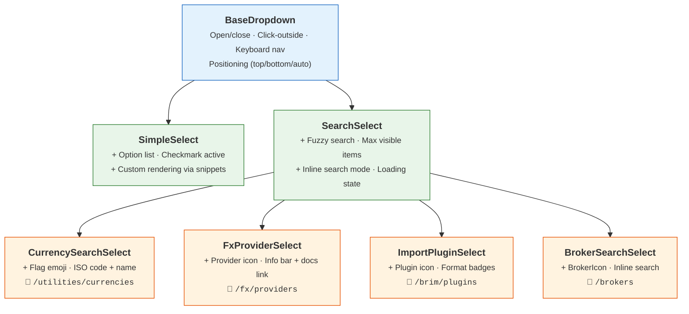

# 🔽 Select & Dropdown Components

This section documents the reusable dropdown and select components in `lib/components/ui/select/`.

All select components are built on `BaseDropdown`, which provides the shared logic for open/close state, click-outside dismissal, keyboard navigation, and dynamic positioning.

## 🏗️ Component Hierarchy

Each level adds features on top of the previous:

- 🔵 **BaseDropdown** — Pure dropdown logic (headless)
- 🟢 **SimpleSelect / SearchSelect** — Generic selects with rendering
- 🟠 **Specialized selects** — Domain-specific with API data loading

---

## 📦 BaseDropdown

The foundation for all dropdown components. A headless component that manages:

- **Open/close** state via click or keyboard (`Enter`, `Space`, `Escape`)
- **Click-outside** dismissal
- **Dropdown positioning** — `top`, `bottom`, or `auto` (detects available space)
- **Keyboard navigation** — `ArrowUp`/`ArrowDown` through items, `Enter` to select

Uses **Svelte 5 Snippets** (`trigger` and `content`) for fully customizable rendering.

**Used by**: `SimpleSelect`, `SearchSelect`, and all specialized selects.

---

## 📋 SimpleSelect

A basic dropdown for selecting from a fixed list of options, similar to a native `<select>`.

- Renders a button trigger showing the selected value
- Displays options in a dropdown with checkmark on the active item
- Supports disabled state and custom item rendering via snippets
- Keyboard navigable

**Used in**: Filter dropdowns, form fields with small option sets (e.g., theme selector, page size).

---

## 🔎 SearchSelect

A dropdown with integrated **fuzzy search**. The user can type to filter options.

- Fuzzy matching on option labels
- Configurable `maxVisibleItems` (default: 8) with scrollable dropdown
- `inlineSearch` mode — search input in the trigger itself (used by BrokerSearchSelect)
- Loading state with spinner
- Supports custom item rendering via `option` snippet

**Used in**: User search in sharing modal, any select with many options.

---

## 💰 CurrencySearchSelect

A specialized `SearchSelect` for currency selection.

- Shows **flag emoji** + currency code + name for each option
- Loads options from the `/utilities/currencies` API
- Filters by code or name
- Auto-selects the first match

**Used in**: Add Pair modal (base/quote currency), Broker form (base currency).
**Data source**: `GET /api/v1/utilities/currencies` — ISO 4217 reference list.

---

## 🔌 FxProviderSelect

A specialized select for FX data providers.

- Shows provider name with icon
- **Info bar** below the dropdown with provider details and a link to the docs page
- Reads `docs_url` from provider metadata to generate the documentation link

**Used in**: `FxProviderConfig` component on the FX detail page.
**Data source**: `GET /api/v1/fx/providers` — registered FX provider plugins.

---

## 📥 ImportPluginSelect

A select for BRIM import plugins.

- Shows plugin name with provider icon (loaded from API)
- Groups plugins by broker type
- Displays supported file formats (CSV, Excel)

**Used in**: `BrokerImportFilesModal` — selecting which parser to use for a broker report.
**Data source**: `GET /api/v1/brim/plugins` — registered BRIM provider plugins.

---

## 🏦 BrokerSearchSelect

A `SearchSelect` specialized for broker selection.

- Shows `BrokerIcon` + broker name for each option
- `inlineSearch` mode — type directly in the trigger to filter
- Loads brokers from the API with user access filtering

**Used in**: Transaction filters, transfer/FX conversion forms (selecting source/destination broker).
**Data source**: `GET /api/v1/brokers` — user's accessible brokers (filtered by RBAC).
