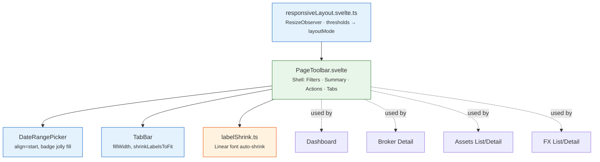

# 🧭 Toolbar & Responsive Layout

`PageToolbar` is the shared shell used by all 6 main pages (Dashboard, Broker Detail, Assets list/detail, FX list/detail) to lay out **filters + summary + actions + tabs** in a single, container-width-driven responsive bar — instead of each page re-implementing its own breakpoint logic.



**Key files**: `lib/utils/layout/responsiveLayout.svelte.ts` (thresholds + `layoutMode`), `lib/components/ui/toolbar/PageToolbar.svelte` (shell), `lib/components/ui/date/DateRangePicker.svelte` (date picker + preset "jolly" badges), `lib/utils/layout/labelShrink.ts` (shared linear label auto-shrink), `lib/utils/layout/dropdownPosition.ts` (shared fixed-position dropdown helper).

---

## 🎯 The 4 layout tiers

`PageToolbar` doesn't use CSS media queries — it uses a `ResizeObserver` on its own container and a set of **pixel thresholds configured per page**. The resulting `layoutMode` always matches the name of the threshold that triggered it (no separate vocabulary to keep in sync):

| `layoutMode` | Triggered when | Picker + Summary ("Centro") | Actions |
|---|---|---|---|
| `oneRow` | width ≥ `oneRow` | side-by-side, picker renders as 1 row (full preset badges) | side-by-side, 2×2 grid |
| `denseRow` | between `denseRow` and `oneRow` | side-by-side, picker renders as 2 internal rows | side-by-side, 2×2 grid |
| `stackFilters` | between `stackFilters` and `denseRow` | stacked below the picker (start-aligned, width capped to the picker's own width) | still **beside** the stacked column, but as a 4×1 vertical list |
| `oneColumn` | width < `stackFilters` | same as `stackFilters` (no further change) | move **below** everything, back to a 2×2 grid |

A page reads 3 semantic flags instead of comparing `layoutMode` strings directly (so a future redefinition only touches `PageToolbar` itself):

- **`filtersStacked`** — true in `stackFilters` + `oneColumn`. The flag pages should read for "my Center content must become full-width/justified".
- **`isStacked`** — true ONLY in `oneColumn` (the whole bar, Actions included, is one column).
- **`actionsStacked`** — true ONLY in `stackFilters` (Actions render as a 4×1 column instead of 2×2).

!!! note "The `oneColumn` threshold itself has no effect"

    Once width drops below `stackFilters`, the tier is *always* `'oneColumn'` — there's no narrower tier below it, so the numeric value of the `oneColumn` threshold is never actually compared. It's kept as a reserved placeholder for a possible future sub-tier, conventionally set to `stackFilters − 40` on every page. The only threshold that actually decides the `stackFilters` ↔ `oneColumn` boundary is `stackFilters` itself.

---

## 🔧 Thresholds — current values per page

Each page passes its own `thresholds` object to `<PageToolbar>` — there's no shared default, every page is tuned independently against its own content:

| Page | `oneRow` | `denseRow` | `stackFilters` | `oneColumn` | `labelHideActions` | `labelHideTabs` |
|---|---|---|---|---|---|---|
| Dashboard | 1000 | 810 | 430 | 390 | 210 | 370 |
| Broker Detail | 1000 | 800 | 470 | 430 | 270 | 370 |
| Assets (list) | 1340 | 850 | 440 | 400 | 250 | 370 |
| Assets (detail) | 1215 | 780 | 400 | 360 | 230 | 370 |
| FX (list) | 1120 | 930 | 440 | 400 | 260 | 370 |
| FX (detail) | 870 | 650 | 400 | 360 | 230 | 370 |

- **`labelHideActions`** / **`labelHideTabs`** — independent thresholds below which Action-button labels / Tab labels disappear entirely (see [Auto-shrink labels](#auto-shrink-labels-before-they-hide) below — hiding is always the *last* resort, not the first reaction to limited space).
- **`noExtraLabel`** *(optional, Dashboard only)* — hides a page-specific decorative label (Dashboard's "Currency:" prefix next to the currency selector) below a given width, independently of the tier system.

!!! tip "Tuning thresholds live, no rebuild needed"

    Every page registers its layout instance on `window.__lfLayouts.<name>` (open DevTools console):

    ```js
    // Available page names: dashboard, brokerDetail, assetsList, assetDetail, fxList, fxDetail
    window.__lfLayouts.dashboard.thresholds
    // { oneRow: 1000, denseRow: 810, stackFilters: 430, oneColumn: 390, ... }

    // Change a threshold — recalculates immediately, no resize needed
    window.__lfLayouts.dashboard.thresholds.stackFilters = 480

    // Read the resulting mode
    window.__lfLayouts.dashboard.layoutMode
    ```

    Widths are compared in **content-box** (the bar's own interior, excluding its `p-4` padding) — `getBoundingClientRect()` in DevTools returns border-box, so subtract ~32px if reading it directly.

---

## 🔡 Auto-shrink labels before they hide

Some languages render the same UI string much longer than others (e.g. French "Vue d'ensemble" vs. shorter equivalents). Instead of hiding a label the moment it doesn't fit, `labelShrink.ts` computes a continuous **linear scale factor** (not a handful of fixed discrete sizes) from real measured geometry and shrinks every label in a group uniformly (down to a 75% floor for readability) — labels only disappear entirely once the independent `labelHideActions`/`labelHideTabs` threshold is crossed.

Used by both `TabBar.svelte` (own `shrinkLabelsToFit` prop) and `PageToolbar.svelte`'s Actions zone (generic — reads `button > span` labels directly, no per-page wiring required).

## 📐 "Justified" Center alignment

When `filtersStacked`, a page's Center content (currency selector, search/filters, price summary, etc.) stacks below the `DateRangePicker` — **start-aligned and capped to the picker's own current width** (via the picker's bindable `effectiveMaxWidth`), never centered and never wider than the picker itself:

```svelte
<DateRangePicker align="start" {layoutMode} bind:effectiveMaxWidth={pickerMaxWidth} />
<div class="{filtersStacked ? 'w-full' : ''}" style={filtersStacked && pickerMaxWidth ? `max-width: ${pickerMaxWidth}px` : ''}>
    <!-- Center content -->
</div>
```

Any row with more than one element in this capped zone uses **`justify-around`** as the universal standard (never `justify-between`/`justify-center`) — for 2 elements this distributes free space exactly 1/4 : 2/4 : 1/4 (start : middle : end), avoiding the oversized gap `justify-between` leaves between small, unrelated controls.

!!! warning "A label and its own control are ONE unit, not two"

    If a row has a decorative label next to its own input/select (e.g. "Currency: [selector]"), wrap **both together** in a shared container before applying `justify-around` to the row — otherwise the label and the control get spaced apart as if they were two independent items.

---

## 📁 Extending the system to a new page

1. Use `<PageToolbar thresholds={{oneRow, denseRow, stackFilters, oneColumn, labelHideActions, labelHideTabs}} layoutDebugName="uniqueName">`. The `filters` zone receives `{layoutMode, isStacked, filtersStacked, showExtraLabels}`, `summary` receives `{layoutMode, isStacked, filtersStacked}`, `actions` receives `{layoutMode, showActionLabels, actionsStacked}`.
2. Pass `align="start"` + `layoutMode={layoutMode}` + the same `debugName` to `DateRangePicker` — without `layoutMode` the picker always stays 1-row, ignoring the page's thresholds. Never wrap it in an extra `<div class="flex flex-1 ...">` with no width cap of its own (`DateRangePicker`'s root already self-applies `grow` + `max-width` when `align="start"`) — an uncapped wrapper grows past the picker's real content and misaligns any sibling zone. If a `data-testid` is needed on the wrapper, use `class="contents"` (exits the box model, keeps the attribute queryable).
3. Give any other element sharing the `filters` row with the picker (currency selector, search box, etc.) `shrink-0` — only the `DateRangePicker` itself should shrink/shed badges under pressure.
4. If a hand-rolled dropdown panel is needed, reuse `getFixedDropdownPosition()`/`clamp()` from `lib/utils/layout/dropdownPosition.ts` (fixed positioning, escapes `PageToolbar`'s own `overflow-hidden` card wrapper) rather than plain `position: absolute`.

**See also**: [Date Pickers](datePickers.md) for `DateRangePicker`'s own preset/badge-fill mechanics.
