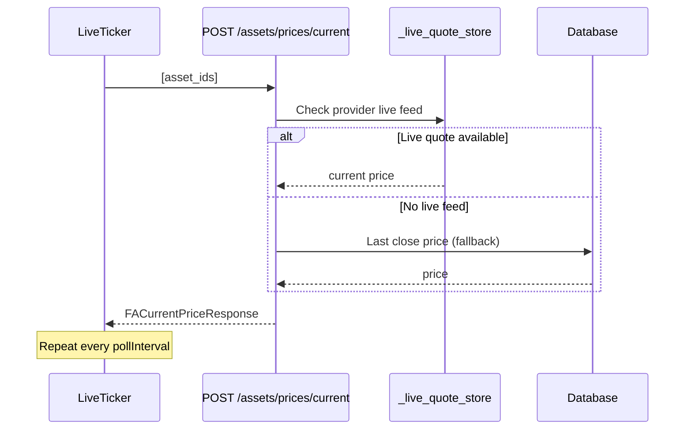

# 📡 LiveTicker Component

The `LiveTicker` component displays **live current prices** for assets in compact badge format. It polls the bulk current-price API endpoint at a configurable interval.

## 📍 Usage Locations

| Location | Props | Description |
|---|---|---|
| **Dashboard** | `<LiveTicker />` | Shows all active assets with live prices |
| **Asset Detail** | `<LiveTicker assetIds={[42]} maxItems={1} />` | Single asset live price next to the asset name |
| **Asset Cards** (list page) | Via `livePrice` prop on `AssetCard` | Inline price text fetched once (no per-card polling) |

## ⚙️ Props

| Prop | Type | Default | Description |
|---|---|---|---|
| `assetIds` | `number[]` | `undefined` | Explicit asset IDs to track. If omitted, all active assets are loaded |
| `pollInterval` | `number` | `30000` | Polling interval in ms |
| `maxItems` | `number` | `0` | Max items to display (0 = unlimited) |

## 🏗️ Architecture

## 🎨 Visual Behaviour

### Non-Blocking Loading

When the component mounts, it immediately shows placeholder items with `--` as the price. The actual API call runs in the background (fire-and-forget). The UI never blocks waiting for prices.

### Dynamic Badge Colors

Each badge transitions colors based on price movement:

| State | Badge Color | Condition |
|---|---|---|
| **Neutral** | Gray | No previous value, or price unchanged |
| **Up** | Emerald/Green | Current price > previous poll price |
| **Down** | Red | Current price < previous poll price |

Color transitions use CSS `transition-colors duration-300` for smooth visual feedback.

### Asset Icons

Each badge includes an `AssetIcon` component with the standard fallback chain:

1. Custom `icon_url` (user-uploaded)
2. Asset type PNG icon (from `/icons/asset-types/`)
3. Fallback `BarChart3` Lucide icon

## 🔗 Related

- 📡 [Bulk Current Price Endpoint](../../api/overview.md#post-apiv1assetspricescurrent-bulk-current-price)
- 💰 [Asset Architecture](../../backend/assets/architecture.md) — Sync pipeline and pricing
- 🧩 [AssetIcon Component](../../frontend/components/index.md) — Icon fallback chain
- 📅 [Asset Events](../../backend/assets/events.md) — Dividend and split events

