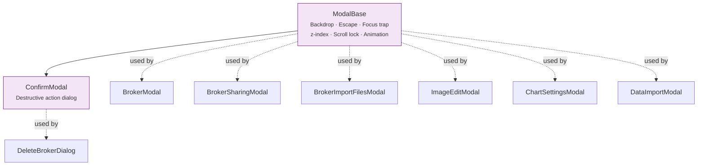

# 🪟 Modals

The modal system in LibreFolio. Every modal extends `ModalBase`.

---

## 🏗️ ModalBase

The **foundation for all modals** in LibreFolio.

- **Backdrop** with configurable opacity and click-outside-to-close
- **Escape** key to close
- **Focus trap** — Tab cycles within modal content
- **Configurable z-index** — Supports stacked modals (e.g., ImageEditModal over AssetPickerModal)
- **Scroll lock** — Prevents body scroll when modal is open
- **Animation** — Fade-in/out transition

**Props**: `isOpen`, `onClose`, `zIndex` (default: 50), `closeOnBackdrop` (default: true), `maxWidth`.

---

## ⚠️ ConfirmModal

A confirmation dialog for **destructive actions**. Extends `ModalBase`.

- Displays a warning message with customizable title and body
- **Confirm** and **Cancel** buttons with configurable labels
- Confirm button styled as danger (red) by default
- Optional loading state on confirm button

**Used by**: [DeleteBrokerDialog](../brokers/modals.md), file deletion, data editor row deletion.

