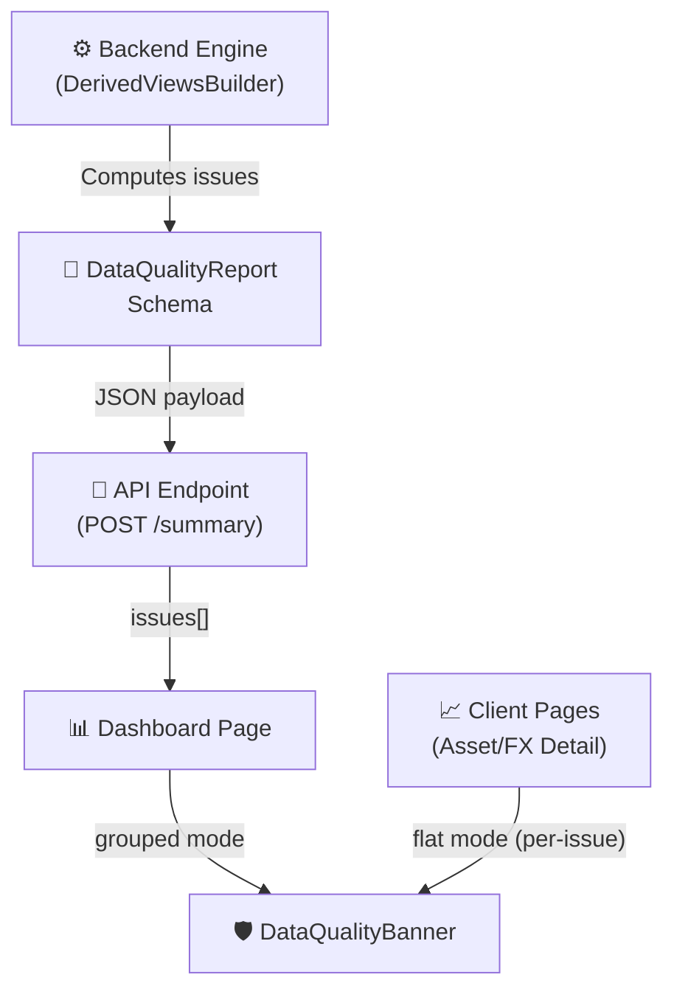

# 🛡️ DataQualityBanner Component

Component and model for unified data quality warnings across the LibreFolio UI.

---

## 🔍 Overview

`DataQualityIssue` is the standard model for surfacing data quality problems (missing prices, missing FX, incomplete NAV, etc.) across three key pages:
- **Dashboard** 📊
- **Asset Detail** 📈
- **Forex Detail** 💱

`DataQualityBanner` is the single, reusable UI component that renders these issues consistently. Before this system existed, each page had its own ad-hoc inline banners — separate markup, no consistency, and no Call-To-Action (CTA). Now, all three pages share the same component and issue model.

### 📁 File Mapping

| File | Role |
|------|------|
| 🐍 `backend/app/schemas/portfolio.py` | Defines `IssueCode`, `IssueSeverity`, `IssueDomain`, `DataQualityIssue`, and `DataQualityReport` schemas. |
| ⚙️ `backend/app/services/portfolio_engine.py` | `DerivedViewsBuilder.build_data_quality_report()` — generates portfolio-wide issues. |
| 🎨 `frontend/src/lib/components/ui/feedback/DataQualityBanner.svelte` | Reusable UI component (supporting `grouped` and `flat` modes). |
| 🌐 `frontend/src/lib/i18n/{en,it,fr,es}.json` | `dataQuality.*` translation namespace for localized warnings. |

---

## 🏗️ Architecture & Data Flow

Here is how data quality reports are computed in the backend and rendered inside SvelteKit pages:



---

## 📁 Component Modes

### 1. `grouped` — Dashboard 📊
* Single amber/sky container grouping all issues.
* Issues are sorted by severity: **Error** 🔴 → **Warning** 🟡 → **Info** 🔵.
* The header adapts dynamically: `"1 error"`, `"2 warnings"`, or `"Data quality note"` (for info-only alerts).
* First 3 issues are visible; an expand button appears when there are more.

```svelte
<DataQualityBanner issues={dataQualityIssues} mode="grouped" onaction={handleBannerAction} />
```

### 2. `flat` — Asset Detail / FX Detail 📈 💱
* One banner is rendered per issue.
* Each banner displays: icon + message + FX pair flags + asset context (in parentheses) + CTA button.

```svelte
<DataQualityBanner issues={assetDetailIssues} mode="flat" onaction={handleBannerAction} />
```

---

## 🖱️ CTA (Call-to-Action) System

The component emits intent — it does not navigate or open modals itself.

```typescript
onaction?: (action: string, target: string | null, issue: DataQualityIssue) => void
```

### 🎯 Active CTA Actions

| Action | Target | Handled By | Description |
|--------|--------|------------|-------------|
| `navigate_asset` | asset_id string | `goto('/assets/' + target)` | Redirects the user to the specific asset details page. |
| `navigate_fx` | FX pair slug | `goto('/fx/' + target + '?start=...&end=...')` | Redirects to the FX pair details page. |
| `add_fx_pair` | FX pair slug | `FxPairAddModal` | Opens the modal to configure the missing FX pair. |

---

## 🏷️ Active IssueCodes

!!! warning "Do Not Add Future-Proof Codes"

    Every `IssueCode` must be actively generated by the backend engine or constructed client-side. Add a new code only in the same step where it is generated. Do not define unused placeholder codes.

### 📊 Portfolio Issues (generated by `DerivedViewsBuilder.build_data_quality_report`)

| Code | Severity | Condition | CTA Action |
|------|----------|-----------|------------|
| `MISSING_PRICE` | 🔴 Error | Asset held with no PriceHistory and no valuation fallback | `navigate_asset` |
| `STALE_PRICE` | 🟡 Warning | Latest price older than staleness threshold | `navigate_asset` |
| `MISSING_FX_MARKET` | 🟡 Warning | Asset in foreign currency without a configured FX pair | `add_fx_pair` |
| `NAV_INCOMPLETE` | 🔵 Info | One or more days had incomplete NAV (caused by above) | none |
| `MWRR_NOT_CALCULABLE` | 🔵 Info | MWRR did not converge or period is too short | none |

### 📈 Asset Detail Issues (built client-side in `assets/[id]/+page.svelte`)

| Code | Severity | Condition | CTA Action |
|------|----------|-----------|------------|
| `ASSET_ARCHIVED` | 🟡 Warning | `assetInfo.active === false` | none |
| `RANGE_BEFORE_FIRST_DATA` | 🔵 Info | Selected range starts before first PriceHistory | none |
| `FX_PAIR_MISSING` | 🟡 Warning | Required FX pair not configured | `add_fx_pair` |
| `FX_PAIR_NO_DATA` | 🟡 Warning | FX pair configured but no rate history | `navigate_fx` |
| `FX_PAIR_PARTIAL_GAP` | 🔵 Info | FX data exists but range starts before first rate | `navigate_fx` |

### 💱 FX Detail Issues (built client-side in `fx/[pair]/+page.svelte`)

| Code | Severity | Condition | CTA Action |
|------|----------|-----------|------------|
| `RANGE_BEFORE_FIRST_DATA` | 🔵 Info | Selected range starts before first rate in DB | none |

---

## 🧪 How to Trigger Issues (Manual Testing)

### 📊 Dashboard

| Issue | How to Trigger |
|-------|----------------|
| `MISSING_PRICE` | Add a BUY transaction for an asset that has no PriceHistory entries. The NAV will exclude it. |
| `STALE_PRICE` | Use an asset that hasn't been synced recently, or manually set `last_price_date` far in the past in the DB. |
| `MISSING_FX_MARKET` | Add an asset in a foreign currency (e.g. USD) when the dashboard target currency is EUR and the EUR/USD pair is not configured. |
| `NAV_INCOMPLETE` | Same scenario as `MISSING_PRICE` or `MISSING_FX_MARKET` — appears automatically when NAV is incomplete for ≥1 day. |
| `MWRR_NOT_CALCULABLE` | Portfolio with only 1 transaction on 1 day. MWRR needs ≥2 nav snapshots with a non-zero cash flow. |

### 📈 Asset Detail

| Issue | How to Trigger |
|-------|----------------|
| `ASSET_ARCHIVED` | Asset detail → Edit modal → check "Archived" → save → reload the page. |
| `RANGE_BEFORE_FIRST_DATA` | In DateRangePicker, set start date to a year before the first PriceHistory entry (e.g. 2018 for an asset with data from 2020). |
| `FX_PAIR_MISSING` | Open an asset in a currency different from the display currency (e.g. USD asset, EUR display) when the EUR/USD pair is **not** configured. |
| `FX_PAIR_NO_DATA` | Create an FX pair via the FX page but skip sync — the pair exists but has no rates. |
| `FX_PAIR_PARTIAL_GAP` | Configure an FX pair with data from 2022. Open an asset detail with date range starting in 2020. |

### 💱 FX Detail

| Issue | How to Trigger |
|-------|----------------|
| `RANGE_BEFORE_FIRST_DATA` | Navigate to `/fx/EUR-USD?start=2000-01-01&end=2000-12-31`. Alternatively set DateRangePicker to a very early start date. |

---

## 🔍 Debugging: Verify `data_quality.issues` Payload

Open browser DevTools → Network → find the `POST /api/v1/portfolio/summary` request.

In the response JSON, look for:

```json
{
  "data_quality": {
    "issues": [
      {
        "code": "MISSING_PRICE",
        "severity": "error",
        "count": 2,
        "affected_asset_names": ["BTP Più SC", "Apple Inc"],
        "cta_action": "navigate_asset",
        "cta_target": "123"
      }
    ]
  }
}
```

*Note: The `issues[]` array is the single source of truth for dashboard banners. For asset/forex detail, issues are constructed client-side (no network request to inspect).*

---

## 🛠️ How to Add a New IssueCode

1. Add the code to `IssueCode` enum in `backend/app/schemas/portfolio.py`.
2. Generate it in the backend engine (`build_data_quality_report`) **or** construct it client-side on the relevant page.
3. Set `severity`, `cta_action`, `cta_target`, `affected_*` fields appropriately.
4. Add `message_i18n_key` and its translations in all 4 language files under `dataQuality.*`.
5. If a new `cta_action` is needed, add its label in `dataQuality.cta.*` and handle it in the parent `onaction` callback.
6. Update this document.
7. Add a backend unit test (if generated by engine) or E2E test (if visible in the UI).
8. Document how to trigger the issue manually.

---

## 🧪 Test Coverage

### 🐍 Backend Unit Tests (`test_data_quality_report.py`)
* Covers all 5 portfolio codes: severity, affected fields, CTA, count, date_range.
* Empty inputs produce no issues.
* All 5 codes can appear together.

Run test suite:
```bash
pipenv run ./dev.py test services roi-fifo-utils
```
*(Covers all of `test_services/test_financial/`)*

### 🎭 Frontend E2E Tests (`e2e/portfolio/data-quality-banners.spec.ts`)
* Dashboard loads without JS errors.
* Legacy inline banners removed (old testids gone).
* Grouped mode structure checks when issues present.
* Header does not show `"0 errors, 0 warnings"` for info-only issues.
* NAV incomplete message includes dates.
* Flat mode: checks that no grouped container is rendered.
* FX pair missing: CTA button checks.

Run test suite:
```bash
pipenv run ./dev.py test front-portfolio banners
```
