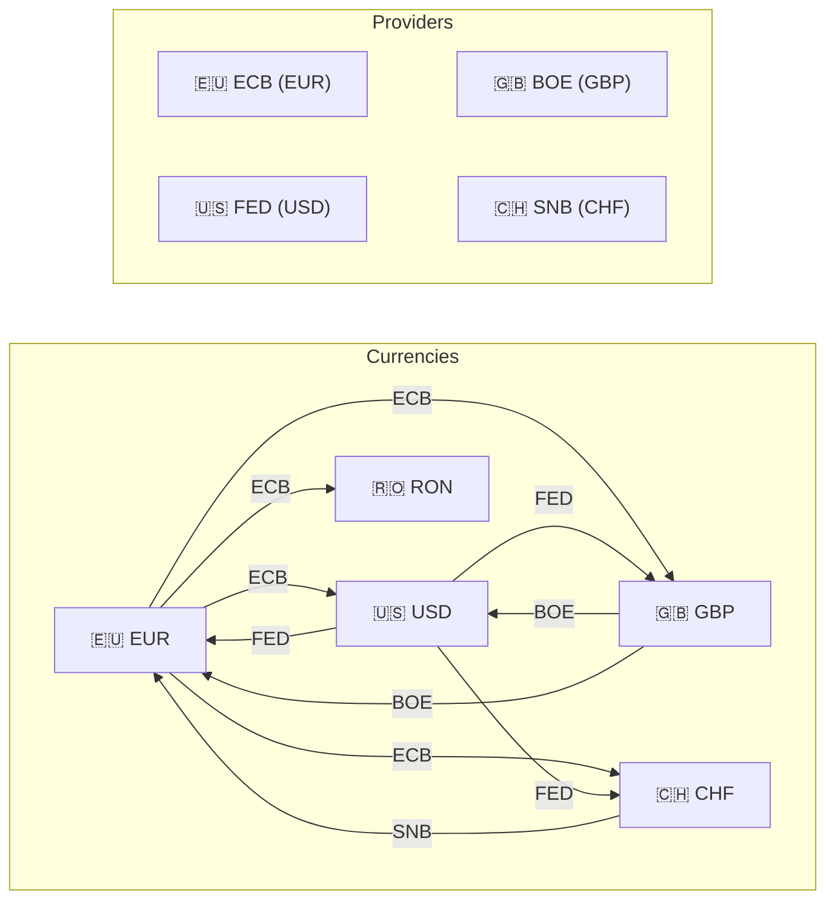
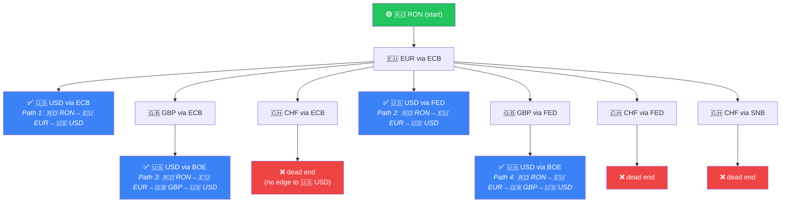

# 🔗 FX Conversion Chain — Pathfinding Algorithm

*Status: Implemented (Mar 2026)*

## 📖 Overview

LibreFolio allows users to convert between any two currencies, even when no single provider covers the pair directly. The frontend builds a **currency graph** and runs a **DFS (Depth-First Search) with backtracking** to discover all possible conversion routes — both direct (1-step) and multi-step (chain).

The algorithm lives in two modules:

| Module | Purpose |
|:-------|:--------|
| `src/lib/utils/currencyGraph.ts` | Graph construction + DFS pathfinding |
| `src/lib/stores/currencyGraphStore.ts` | Session-level caching + public API |

## 🌐 The Currency Graph

The graph is a **MultiDirectedGraph** (from the [graphology](https://graphology.github.io/) library):

- **Nodes** = all ISO 4217 currency codes (~180), from `GET /utilities/currencies`
- **Edges** = provider capabilities, from `GET /fx/providers`

### 🔗 Edge Construction

For each provider `P` (excluding `MANUAL`):

- For each base `B` in `P.base_currencies`
- And target `T` in `P.target_currencies` (with `B != T`)

**Add Directed Edge:** `B ➔ T` with payload `{provider: P.code}`

Key design decisions:

1. **Single directed edges** — one edge $B \to T$ per (provider, base, target). No reverse edge $T \to B$ is added.
2. **Bidirectionality via DFS** — the DFS explores both outbound edges ($B \to T$) and **inbound** edges ($T \leftarrow B$) at each node, effectively traversing in reverse.
3. **Multi-graph** — if two providers both cover 🇪🇺 EUR→🇺🇸 USD, there are two parallel edges with different `provider` attributes.

### ❓ Why Single-Direction Edges?

| Approach | Edges | Pros | Cons |
|:---------|:------|:-----|:-----|
| Bidirectional (2 edges per pair) | `2 * E` | Simple DFS (outbound only) | Doubled memory, unclear semantics |
| **Single + DFS inbound** ✅ | `E` | Clear semantics, compact | DFS must explore 2 directions |

The single-direction approach encodes the real relationship: *"Provider P publishes rates from B to T"*. The backend's `compute_chain_rate()` uses alphabetical normalization to decide whether to use the rate directly or invert it ($1/\text{rate}$).

## 📐 Simplified Example Graph

Consider 4 providers and 5 currencies:



Each arrow is a directed edge with the provider label. The DFS can traverse any edge in reverse (e.g., go from 🇺🇸 USD to 🇪🇺 EUR via the ECB edge 🇪🇺 EUR→🇺🇸 USD).

### 📋 Example: All Routes from 🇷🇴 RON to 🇺🇸 USD

Starting from **🇷🇴 RON**, the DFS finds these paths:

| # | Path | Steps | Providers |
|:--|:-----|:------|:----------|
| 1 | `🇷🇴 RON →[ECB]→ 🇪🇺 EUR →[ECB]→ 🇺🇸 USD` | 2 | ECB × 2 |
| 2 | `🇷🇴 RON →[ECB]→ 🇪🇺 EUR →[FED]→ 🇺🇸 USD` | 2 | ECB + FED |
| 3 | `🇷🇴 RON →[ECB]→ 🇪🇺 EUR →[BOE]→ 🇬🇧 GBP →[BOE]→ 🇺🇸 USD` | 3 | ECB + BOE × 2 |
| 4 | `🇷🇴 RON →[ECB]→ 🇪🇺 EUR →[SNB]→ 🇨🇭 CHF →[FED]→ 🇺🇸 USD` | 3 | ECB + SNB + FED |
| 5 | `🇷🇴 RON →[ECB]→ 🇪🇺 EUR →[FED]→ 🇬🇧 GBP →[BOE]→ 🇺🇸 USD` | 3 | ECB + FED + BOE |
| ... | *(other 3-4 step combinations)* | 3-4 | ... |

Route 1 is the shortest (2 steps) and uses only ECB. Route 2 mixes ECB and FED. Longer chains provide more fallback options but carry higher failure risk.

!!! warning "Chain Failure Risk"

    If **any single step** in a chain fails (provider down, API error), the **entire chain** fails. Shorter chains are more reliable.

## 🔍 DFS Algorithm

### 📝 Pseudocode

```
function findAllPaths(graph, source, target, maxDepth=4):
    validPaths = []

    function dfs(currentNode, pathEdges, visitedNodes, providerUseCount):
        if currentNode == target:
            validPaths.append(copy(pathEdges))
            return

        if len(pathEdges) >= maxDepth:
            return

        function tryEdge(neighbor, provider):
            if neighbor ∈ visitedNodes:        ← Constraint 1
                return
            if providerUseCount[provider] >= 2: ← Constraint 2
                return

            // ADVANCE
            pathEdges.push({from: currentNode, to: neighbor, provider})
            visitedNodes.add(neighbor)
            providerUseCount[provider] += 1

            dfs(neighbor, pathEdges, visitedNodes, providerUseCount)

            // BACKTRACK
            pathEdges.pop()
            visitedNodes.remove(neighbor)
            providerUseCount[provider] -= 1

        // Explore outbound edges (native direction)
        for each edge (currentNode → T) with provider P:
            tryEdge(T, P)

        // Explore inbound edges (reverse direction)
        for each edge (S → currentNode) with provider P:
            tryEdge(S, P)

    dfs(source, [], {source}, {})
    return sort(validPaths, by=length)
```

### 📏 Constraints

The DFS enforces **two constraints** at each step to produce valid, non-redundant routes:

#### 🔄 Constraint 1 — Simple Paths (No Repeated Nodes)

$$
\text{neighbor} \notin \text{visitedNodes}
$$

Each node (currency) can appear **at most once** in a path. This eliminates:

- **Trivial cycles**: A → B → A (returning to the same node)
- **Redundant round-trips**: 🇪🇺 EUR → 🇺🇸 USD → 🇬🇧 GBP → 🇪🇺 EUR → 🇷🇴 RON (the 🇪🇺 EUR→🇺🇸 USD→🇬🇧 GBP→🇪🇺 EUR detour is pointless and introduces unnecessary failure risk)

The source node is added to `visitedNodes` at initialization, so the DFS can never return to it. The target node is **not** in `visitedNodes` — it serves as the exit condition.

!!! note "Evolution"

    The original algorithm used `usedEdgePairs: Set<string>` (tracking visited *edges*, not *nodes*). This allowed the same node to appear multiple times if reached via different edge pairs, producing redundant cycles like `🇪🇺 EUR→🇺🇸 USD→🇬🇧 GBP→🇪🇺 EUR→🇷🇴 RON`. Switching to `visitedNodes` (simple paths) eliminated these and guarantees each conversion chain is **unique and optimal**.

#### 2️⃣ Constraint 2 — Max 2 Uses per Provider

$$
\text{providerUseCount}[\text{provider}] < 2
$$

A provider can be used **at most twice** in the same path. This reflects the real-world topology:

- A provider like ECB has **one base** (🇪🇺 EUR) and **many targets** (🇺🇸 USD, 🇬🇧 GBP, 🇨🇭 CHF, 🇷🇴 RON, ...).
- To "bridge through" 🇪🇺 EUR using ECB, you need **two edges**: one to reach 🇪🇺 EUR, one to leave 🇪🇺 EUR.
  Example: `🇷🇴 RON →[ECB]→ 🇪🇺 EUR →[ECB]→ 🇺🇸 USD` (2 uses of ECB).
- A third ECB edge would be redundant: you'd have already left the ECB hub.

### Backtracking

The DFS uses **mutable state with explicit undo** (backtracking):

```
// ADVANCE — modify state
pathEdges.push(step)
visitedNodes.add(neighbor)
providerUseCount[provider] += 1

// RECURSE — explore from neighbor
dfs(neighbor, ...)

// BACKTRACK — undo state
pathEdges.pop()
visitedNodes.remove(neighbor)
providerUseCount[provider] -= 1
```

This pattern is memory-efficient: only one path is in the stack at a time, regardless of how many paths exist. Each path is copied to `validPaths` only when the target is reached.

### Bidirectional Traversal

At each node, the DFS explores edges in **both directions**:

```typescript
// OUTBOUND: currentNode is the edge source (native direction)
// Edge: currentNode → neighbor | rate used as-is
graph.forEachOutboundEdge(currentNode, (_, attrs, _, tgt) => {
    tryEdge(tgt, attrs.provider);
});

// INBOUND: currentNode is the edge target (reverse direction)
// Edge: neighbor → currentNode | rate inverted (1/rate) by backend
graph.forEachInboundEdge(currentNode, (_, attrs, src, _) => {
    tryEdge(src, attrs.provider);
});
```

The `ChainStep` always records the **logical** direction: `{ from: currentNode, to: neighbor }`. The backend determines whether to use the rate directly or invert it via alphabetical normalization in `compute_chain_rate()`.

### Visualization: DFS Tree for 🇷🇴 RON → 🇺🇸 USD



!!! info "Pruning"

    Branches are pruned early: if a neighbor is in `visitedNodes` or the provider is at max usage, `tryEdge` returns immediately without recursing.

## Complexity

With $N$ = number of currencies, $E$ = number of edges, $D$ = `maxDepth`:

| Metric | Value | Notes |
|:-------|:------|:------|
| Time (worst case) | $O(E^D)$ | Exponential in depth, but $D=4$ is small |
| Time (practical) | **< 1ms** | ~4 providers × ~25 currencies, ~200 edges |
| Space | $O(D)$ | Path stack depth (recursive DFS) |
| Output | Sorted by length | Shortest paths first |

The graph is small enough that Web Worker parallelization is not needed. Profiling shows sub-millisecond execution even with all providers enabled.

## Session-Level Caching

The graph is built **once** per browser session and cached in `currencyGraphStore.ts`:

```typescript
// Module-level singleton
let cachedGraph: MultiDirectedGraph | null = null;

export async function getOrBuildGraph(): MultiDirectedGraph {
    if (cachedGraph) return cachedGraph;

    const [providers, currencies] = await Promise.all([
        fetchProviders(),
        fetchCurrencies(),
    ]);
    cachedGraph = buildCurrencyGraph(providers, currencies);
    return cachedGraph;
}
```

**Why this works**: provider capabilities (`GET /fx/providers`) and currency lists (`GET /utilities/currencies`) are constant for the entire server session — they only change on server restart. No cache invalidation is needed.

## Route Sorting in the UI

When multiple paths are found, `FxProviderSelect.svelte` sorts them:

1. **Direct routes** (1-step) appear first in their own section
2. **Chain routes** are grouped by step count (2-step, 3-step, 4-step)
3. Within each group, chains are sorted by:
    1. **Configured intermediate legs** (descending) — chains that reuse already-registered pairs appear first
    2. **Unique provider count** (ascending) — fewer providers = simpler
    3. **Key** (alphabetical tiebreaker)

## Output Format

Each path is a `ChainStep[]` array, directly usable as `chain_steps` in `POST /fx/providers/routes`:

```typescript
interface ChainStep {
    from: string;    // Source currency (logical direction)
    to: string;      // Target currency (logical direction)
    provider: string; // Provider code (e.g., "ECB")
}

// Direct route
[{ from: "EUR", to: "USD", provider: "ECB" }]

// 2-step chain
[
    { from: "RON", to: "EUR", provider: "ECB" },
    { from: "EUR", to: "USD", provider: "ECB" }
]
```

No transformation is needed between the DFS output and the API request body.
