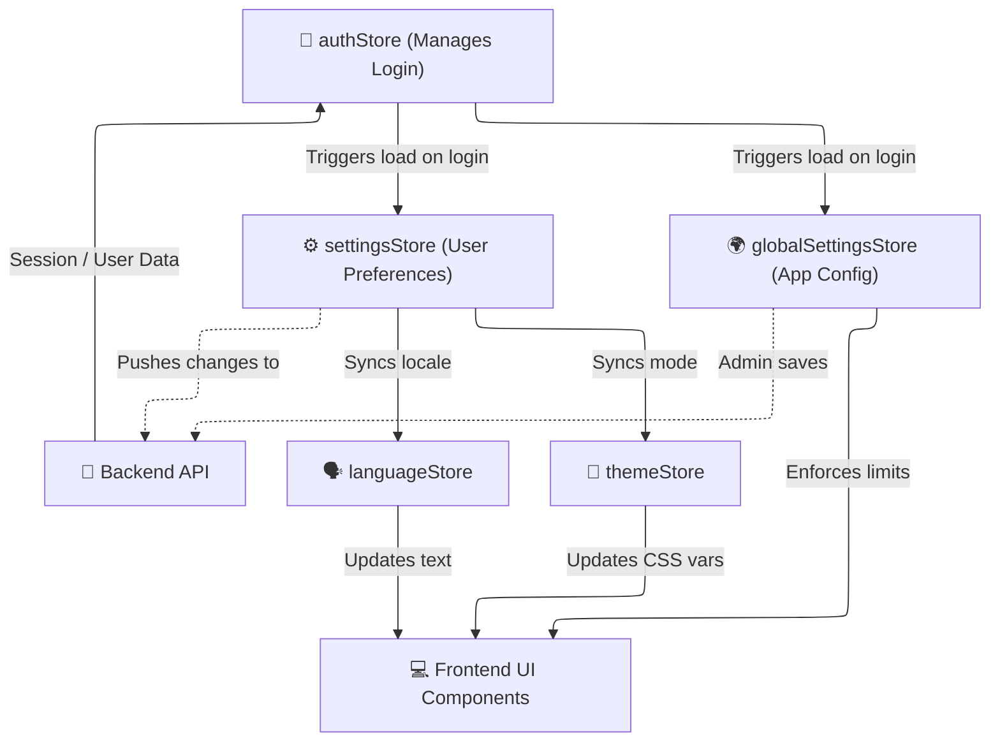

# 📱 App & UI State

*Status: Implemented (Feb 2026)*

The **App & UI State** category contains stores responsible for the global user experience. These stores manage authentication, global preferences, localization, and shell navigation.

## 🗂️ Stores

| Store | File | Purpose |
|:------|:-----|:--------|
| **Auth** | `app/auth.ts` | Manages login status, JWT tokens, and the current user object. |
| **Settings** | `app/settings.ts` | User-specific preferences (language, theme, base currency, avatar). Syncs with the backend. |
| **Global Settings** | `app/globalSettings.ts` | Application-wide settings (admin-only writes), like max upload sizes. |
| **Language** | `app/language.ts` | Controls the `svelte-i18n` locale. Reacts to changes in the Settings store. |
| **Theme** | `app/themeStore.ts` | Manages dark/light mode toggling and system-preference detection. |
| **Navigation** | `app/navigationStore.ts` | Controls the sidebar state (open/closed) and active page tracking. |
| **Toasts** | `app/toastStore.svelte.ts` | Svelte 5 Rune-based store for displaying global notification messages. |
| **Chart Settings** | `chartSettingsStore.svelte.ts` | Global preferences for ECharts (e.g., toggle series, chart types). |
| **Date Range** | `dateRangeStore.svelte.ts` | Global date picker state (start date, end date) shared across Dashboard and Portfolio. |

## 📐 Architecture & Flow

The following diagram shows how the `auth` store initializes the application and how `settings` cascades its values down to `theme` and `language`.

### 🔐 Authentication Flow

1. **Mount**: On app load, `auth.checkAuth()` verifies the existing cookie with the backend.
2. **Success**: If authenticated, `settings` and `globalSettings` are fetched.
3. **Cascade**: `settings.language` updates the `languageStore`, and `settings.theme` updates the `themeStore`.
4. **Immediate Update**: When a user changes a setting in the UI, `settings.setDirect()` updates the frontend instantly for a snappy UX, while asynchronously saving to the API.
