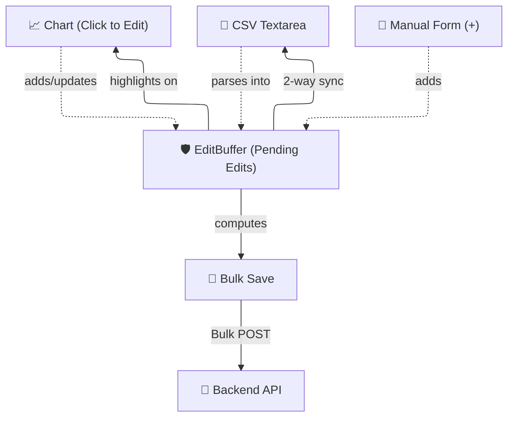

# 🛠️ Core Infrastructure

*Status: Implemented (Feb 2026)*

The **Core Infrastructure** category contains the foundational classes, wrappers, and utilities used to build the rest of the Store Client System. These modules do not contain business data themselves; rather, they provide standard behaviors (CRUD, History, Draft editing) that other stores inherit or use.

## 🗂️ Stores

All these modules are located in `src/lib/stores/core/`.

| Module | Purpose |
|:-------|:--------|
| **`entityStore`** | Base generic class factory (`createEntityStore`) for CRUD operations. Used to create all Reference State stores (`brokerStore`, `assetStore`, etc.). Handles normalization, caching, and optimistic merging. |
| **`EditBuffer`** | Bidirectional edit buffer class for pending time-series modifications. Provides sync between chart click-to-edit, CSV textareas, and manual forms. |
| **`TimeSeriesStore`** | A specialized generic cache for managing historical data points (keyed by ISO date). Handles gap detection (`getMissingRanges`) to minimize API calls and merges partial time-series datasets. |

## 📐 Architecture & Flow (EditBuffer Pattern)

One of the most complex UX challenges is handling bulk edits on time-series charts (like Asset Prices or FX Rates): you want reactive inputs from multiple sources (chart clicks, CSV, forms) but you don't want to pollute the central store until the user clicks "Save".

The `EditBuffer` solves this by sitting *between* the UI interactions and the backend API.

### 🧠 How it Works

1. **Initialization**: When the user enters "Edit Mode" on a chart (like FX rates or Asset prices), an empty `EditBuffer` is instantiated.
2. **Editing**: The user can click on the chart to move a point, type directly into a CSV textarea, or use a form. All these actions add or update `PendingEdit` entries inside the `EditBuffer`.
3. **Synchronization**: The `EditBuffer` maintains a 2-way sync. E.g., if a user drags a point on the chart, the CSV textarea automatically updates its text to reflect the new value.
4. **Bulk Save**: When the user clicks Save, the `EditBuffer` aggregates all pending edits and sends a single bulk request to the backend API, updating the actual historical data.
