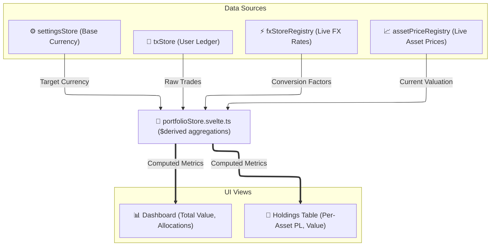

# 🧠 Domain & Feature State

*Status: Implemented (Feb 2026)*

The **Domain & Feature State** houses the heavy computational stores that implement core business logic, such as portfolio calculation, transaction ledgers, and foreign exchange (FX) graph routing. These stores often consume data from both Reference State and Registries.

## 🗂️ Stores

| Store | Location | Purpose |
|:------|:---------|:--------|
| **`portfolioStore`** | `portfolio/portfolioStore.svelte.ts` | The most complex store. Calculates holdings, performance, and allocations by combining user transactions with live asset prices and FX rates. |
| **`txStore`** | `transactions/txStore.svelte.ts` | The master ledger of user transactions. Supports infinite scrolling, complex filtering, and bulk operations. |
| **`currencyGraphStore`** | `currencyGraphStore.ts` | Caches the multi-directed currency graph used by the DFS algorithm to find conversion routes (FX Chain Algorithm). |
| **`fxCardInversionStore`** | `fx/fxCardInversionStore.ts` | UI-specific domain state tracking which FX pairs the user has "flipped" visually (e.g., viewing USD/EUR instead of EUR/USD). |

## 📐 Architecture & Flow (Portfolio Calculation)

The `portfolioStore` acts as a central aggregator. It does not fetch data directly; instead, it observes other stores and reactively recalculates the entire portfolio whenever inputs change.

### 🧮 Portfolio Reactivity

Because `portfolioStore` is built using Svelte 5 Runes (`$derived`), it recalculates automatically and efficiently:
1. When `txStore` adds a new transaction, the total shares for that asset are updated.
2. When the WebSocket pushes a new price to the `assetPriceRegistry` for that asset, the "Current Value" metric recalculates.
3. If the asset is in USD and the user's `settingsStore` base currency is EUR, the value is passed through the live rate provided by `fxStoreRegistry`.
4. The Dashboard instantly reflects the new Net Worth.
