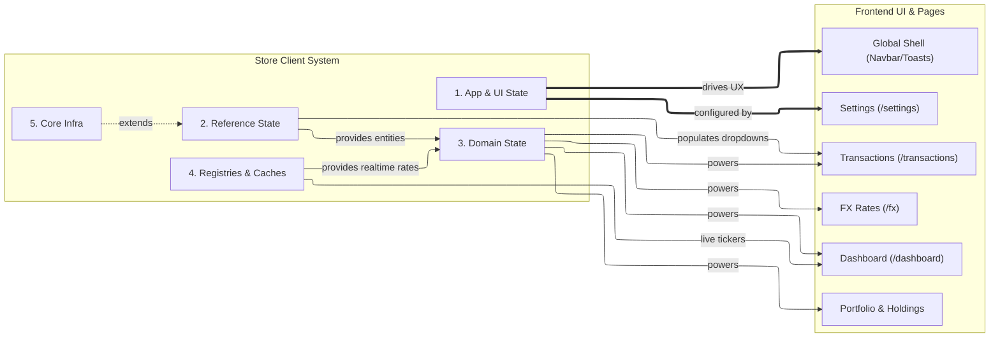

# 📦 Store Client System Overview

*Status: Implemented (Feb 2026)*

## 📖 Introduction

LibreFolio relies on a robust and segmented store architecture. Given the complexity of tracking real-time asset prices, portfolio computations, global settings, and user navigation, the frontend uses a combination of **Svelte Stores** and **Svelte 5 Runes** (`$state`, `$derived`, `$effect`) located in `src/lib/stores/`.

The Store Client System is divided into **5 Macro-Categories**, each with its own dedicated documentation page:

1. **[App & UI State](app-state.md)**: Manages global UX elements (Authentication, Settings, Theme, Navigation, Toasts).
2. **[Reference State](reference-state.md)**: Stores dictionaries and basic CRUD entities (Brokers, Assets, Currencies) synced with the backend.
3. **[Domain & Feature State](domain-state.md)**: Heavy computational and business logic stores (Portfolio calculation, FX graph routing, Transaction ledger).
4. **[Registries & Caches](registries.md)**: Dynamic stores that spawn sub-stores per entity (Asset Prices, FX Rates, Image Previews).
5. **[Core Infrastructure](core-infrastructure.md)**: Base classes and utility wrappers (`EntityStore`, `EditBuffer`, `TimeSeriesStore`) used to build the other stores.

## 🗺️ High-Level Architecture & UI Mapping

The following diagram illustrates how the major store categories interact with the Frontend UI Systems (Pages and generic components).

### 🔄 Reactivity Paradigm

- **Local State**: Component-level reactivity is handled exclusively via **Svelte 5 Runes** (`$state`, `$derived`).
- **Global State**: Cross-component data sharing is managed via exported Svelte stores (both classic `.subscribe` stores and new `.svelte.ts` reactive modules).
- **Backend Sync**: Most reference and domain stores wrap API calls, automatically fetching data on mount and pushing updates back to the Python backend.

---

**Next Steps**: Dive into the specific categories using the navigation menu to understand the internal structure of each subsystem.
