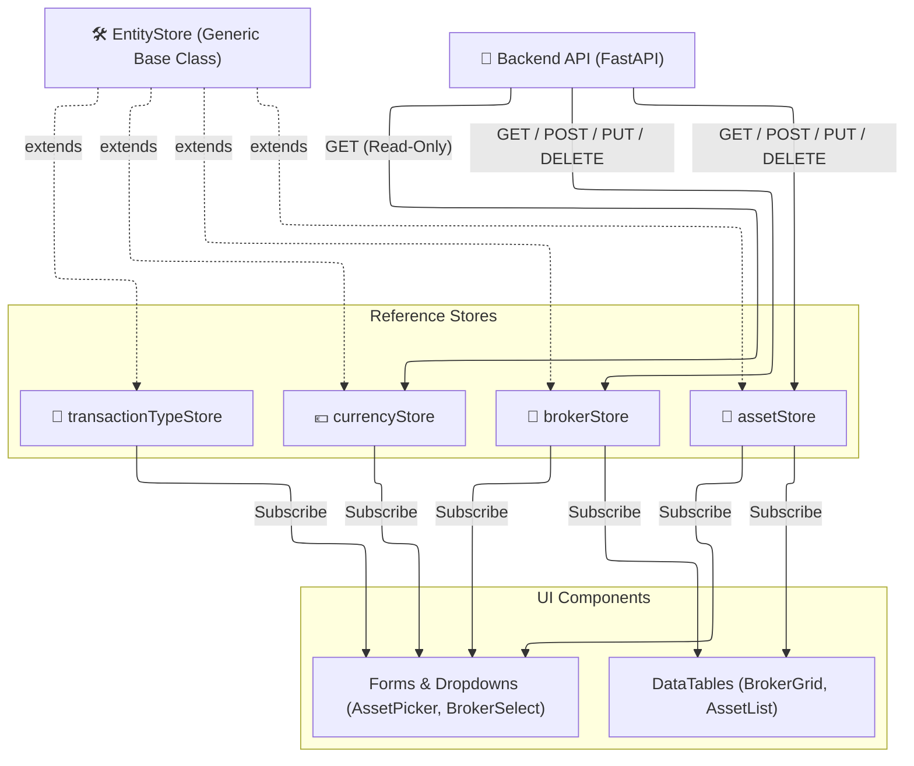

# 🗃️ Reference State

*Status: Implemented (Feb 2026)*

The **Reference State** manages domain entities that act as "dictionaries" or master data. These entities are rarely mutated rapidly by the system itself but are created, updated, or deleted by the user (CRUD operations).

## 🗂️ Stores

All these stores are located in `src/lib/stores/reference/` (with one exception).

| Store | API Endpoint | Purpose |
|:------|:-------------|:--------|
| **`brokerStore`** | `/brokers` | List of brokers configured by the user. Used in the Dashboard, Broker Detail, and Transactions. |
| **`assetStore`** | `/assets` | Master list of all tracked financial instruments (Stocks, ETFs, Crypto). |
| **`currencyStore`** | `/utilities/currencies` | System list of available ISO 4217 currencies and symbols. |
| **`countryStore`** | `/utilities/countries` | System list of ISO 3166-1 alpha-2 countries. |
| **`sectorStore`** | `/utilities/sectors` | Predefined global sectors (Technology, Healthcare, etc.). |
| **`transactionTypeStore`** | `/transactions/types` | List of valid Tx Types (BUY, SELL, DIVIDEND) and their behavioral rules. (Located in `transactions/`) |

## 📐 Architecture & Flow

All reference stores share a common ancestor: the `EntityStore` (documented in [Core Infrastructure](core-infrastructure.md)). This drastically reduces boilerplate for CRUD operations.

### 🔄 Reactivity & Caching

The `EntityStore` provides standard caching out of the box:
1. **Initial Load**: Calling `.load()` fetches the array from the backend. Subsequent calls resolve immediately using the cached array, unless a `force=true` flag is passed.
2. **Optimistic Updates**: Creating or updating an entity via the store methods (`.create()`, `.update()`) immediately updates the local Svelte array, triggering UI reactivity, while simultaneously making the backend API call.
3. **Rollback**: If the API call fails, the store reverts to the previous state and fires an error toast.
