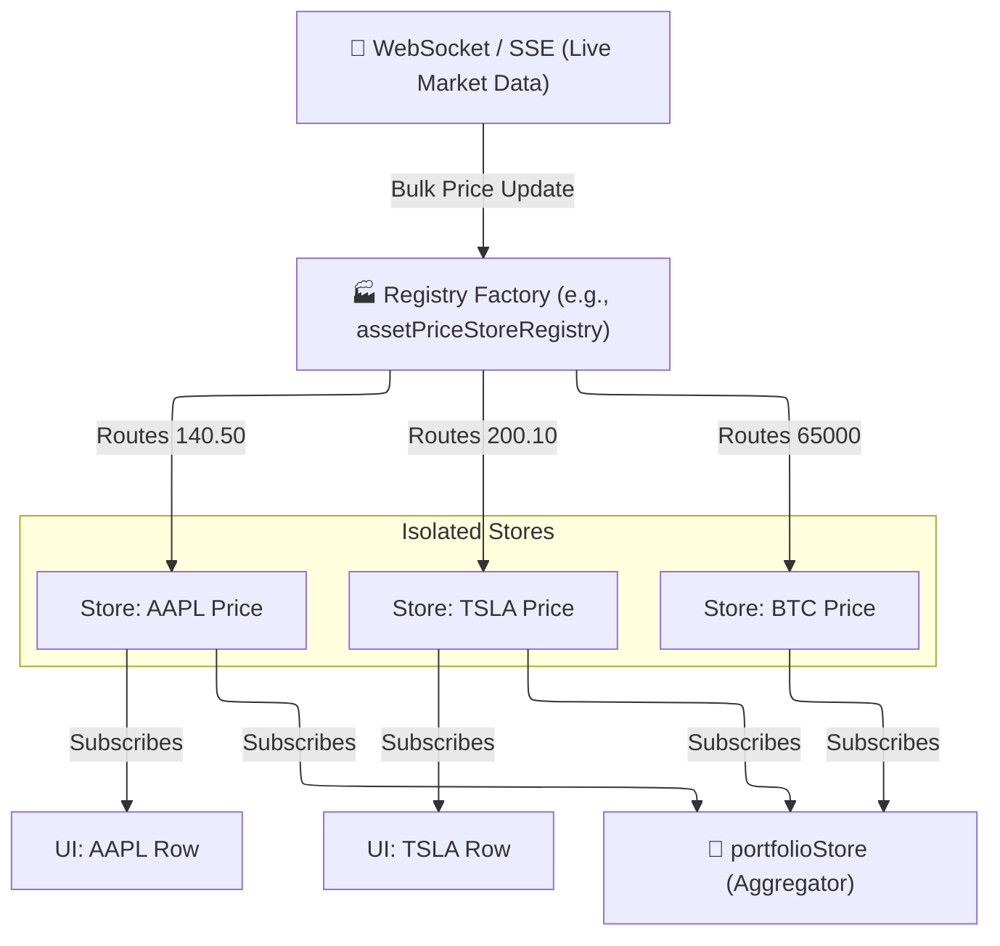

# 🏭 Registries & Caches

*Status: Implemented (Feb 2026)*

The **Registries & Caches** category represents a specialized pattern used in LibreFolio to manage highly volatile or heavily fragmented data, such as real-time market prices, FX conversion rates, and blob URLs.

Unlike standard stores that hold a single array of entities, a **Registry** acts as a dynamic factory and manager of *many independent stores*.

## 🗂️ Stores

| Store | Location | Purpose |
|:------|:---------|:--------|
| **`assetPriceStoreRegistry`** | `assetPriceStoreRegistry.ts` | Maintains an independent Svelte store for the price of *each* individual asset ID. |
| **`fxStoreRegistry`** | `fxStoreRegistry.ts` | Maintains an independent store for the current exchange rate of *each* specific `base:target` currency pair. |
| **`imagePreviewCache`** | `files/imagePreviewCache.ts` | Acts as an LRU cache or map for `Blob` URLs generated for image previews to prevent memory leaks. |

## 📐 Architecture & Flow (The Registry Pattern)

If the Dashboard displays 50 different assets, having a single monolithic `priceStore` update 10 times a second would trigger reactivity across the entire UI constantly. 

Instead, the **Registry Pattern** isolates reactivity:

### 🧠 How it Works

1. **Requesting a Store**: When a UI component like `AssetRow` renders, it asks the registry for a store: `const price = assetPriceStoreRegistry.getStore("AAPL")`.
2. **Lazy Initialization**: If the store for "AAPL" doesn't exist, the registry creates it, initiates an API/WebSocket subscription for that specific ticker, and returns the store.
3. **Isolated Reactivity**: When the price of AAPL changes, *only* the `AAPL` store updates. The `TSLA` row does not re-render, saving immense CPU overhead.
4. **Cleanup**: When components unmount, the registry can detect that "AAPL" has 0 subscribers and unsubscribe from the backend stream to save bandwidth.
