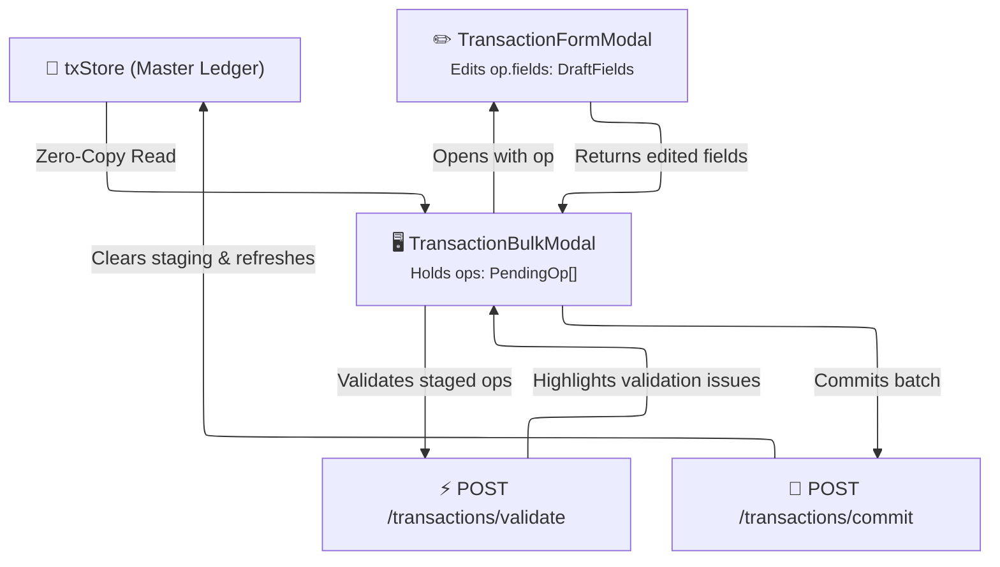
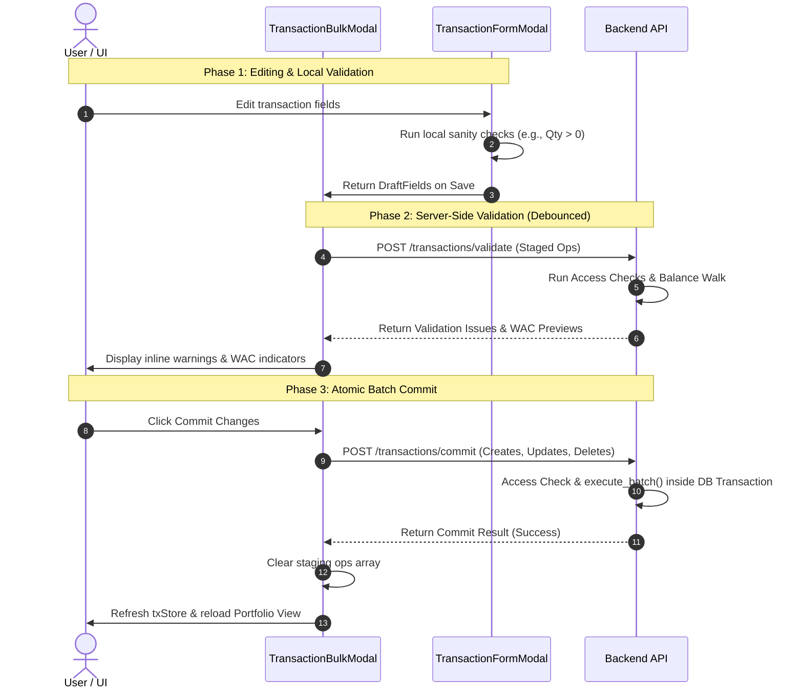

# 📝 Transaction Staging State

This document describes how LibreFolio manages the transient staging state of transactions in the frontend before they are committed in bulk to the database.

---

## 🏗️ Architecture Overview

The staging state acts as a local in-memory sandbox where users can add, edit, clone, split, promote, and delete transactions. Rather than immediately saving changes, the operations are staged in the `TransactionBulkModal` as a list of operations. 



---

## 🏷️ The `PendingOp` Tagged Union

LibreFolio represents each staged row as a `PendingOp`. It is implemented as a TypeScript **discriminated (tagged) union** in `TransactionBulkModal.svelte` that separates metadata from pure transaction data fields (`DraftFields`).

### State Schema

```typescript
interface DraftFields {
    broker_id: number;
    asset_id: number | null;
    type: TransactionTypeCode;
    date: string;
    quantity: string;
    cash: { code: string; amount: string; } | null;
    tags: string[];
    description: string;
    asset_event_id: number | null;
    cost_basis_override: { code: string; amount: string; } | null;
    cost_basis_mode: 'auto' | 'manual' | null;
}

interface PartnerDisplay {
    partnerId?: number;
    partnerBrokerId?: number;
    partnerCash?: { code: string; amount: string; } | null;
    partnerDate?: string;
    partnerPayload?: TxFields | null;
}

type PendingOp = (
    | { op: 'create'; } // Brand new row
    | { op: 'edit'; txId: number; markedDelete: boolean; addedViaPicker?: boolean; } // Existing DB row
) & {
    tempId: string;
    fields: DraftFields;
    pairedWith?: string; // Links main leg tempId with partner leg tempId
    link_uuid?: string | null; // Shared pairing UUID for transfers & conversions
    inaccessible?: boolean; // Read-only marker for rows on inaccessible accounts
    _wacCache?: WacResultEntry | null; // Transient WAC results returned by validate
} & PartnerDisplay;
```

---

## ⚡ Core Design Principles

### 1. Zero-Copy Originals
For edits (`op: 'edit'`), the staging state **never** stores a copy of the database row. The single source of truth is always the `txStore`. The original values are read live on-demand via `txStoreGet(op.txId)`. This ensures that if the transaction is modified elsewhere, the staging state remains in sync without stale data risks.

### 2. Derived Row Status
Row status is calculated dynamically at runtime. It is never stored as an editable property. The helper function `deriveStatus(op)` computes it instantly based on Svelte reactivity:

| Operation Mode | Condition | Derived Status | Description |
|----------------|-----------|----------------|-------------|
| `op.op === 'create'` | Always | `new` | A newly appended transaction row |
| `op.op === 'edit'` | `markedDelete === true` | `delete` | Row marked to be removed |
| `op.op === 'edit'` | `fields` match `txStoreGet(txId)` | `original` | Unchanged row |
| `op.op === 'edit'` | `fields` differ from `txStoreGet(txId)` | `edited` | Row has local modifications |

---

## ✂️ Split & Promote Integration

The tagged union structure of `PendingOp` simplifies complex composite operations in Svelte:

* **Split**: Breaks a composite pair (like `TRANSFER` or `FX_CONVERSION`) into two independent transactions.
  - Sets `markedDelete: true` on the original composite transaction.
  - Appends two new `create` operations mapped to the appropriate independent types (e.g., `WITHDRAWAL` and `DEPOSIT`) via the `SPLIT_TYPE_MAP`.
* **Promote**: Merges two independent transactions (e.g., a `WITHDRAWAL` and a `DEPOSIT`) into a linked pair.
  - Converts both into edit operations.
  - Generates a new `link_uuid` and assigns it to both operations, transforming them into a composite type.

---

## 📤 Validation & Commit Pipeline

Staged operations undergo a two-phase validation before they are persisted:



### 1. Local Sanity Checks
Before sending data to the server, basic local rules are checked (e.g., quantity must be positive, type must be selected).

### 2. Server-Side Validation (`/transactions/validate`)
LibreFolio defers all deep ledger validation (such as checking if a sale results in a negative cash or asset balance) to the backend.
* **Auto-Validation**: If the number of staged operations $N \le 50$, the frontend debounces (1s) and automatically checks the staging state with the server.
* **Manual Validation**: Above 50 rows, the auto-validation is disabled to conserve performance, requiring the user to click the manual `⚡ Validate now` button.

### 3. Batch Commit (`/transactions/commit`)
On commit, the frontend resolves `PendingOp[]` into three clean payloads (creates, updates, and deletes) via `buildBatchPayload()`. These are sent as a single atomic batch transaction:
* **Creates**: Array of brand-new transaction data.
* **Updates**: Key-value diffs containing only modified fields vs the original `txStore` data.
* **Deletes**: List of transaction IDs marked for deletion.

---

## 🗺️ The `WorkspaceIntent` Pattern

To keep components decoupled and avoid passing large, stale arrays of transaction objects, LibreFolio uses a declarative routing pattern to open the bulk transaction workspace. 

Instead of passing copies of data, the calling component (such as the transactions page or toolbar) sets a reactive `intent` property on the `TransactionBulkModal`:

```typescript
export type WorkspaceIntent = 
  | { action: 'create'; }                      // Open empty grid to add new rows
  | { action: 'import'; }                      // Mount BRIM wizard to parse files
  | { action: 'edit'; txIds: number[]; }       // Edit specific existing rows
  | { action: 'delete'; txIds: number[]; }     // Pre-mark specific rows for deletion
  | { action: 'clone'; txIds: number[]; };     // Copy existing rows with today's date
```

Upon receiving the intent, `TransactionBulkModal` resolves the actual row data directly from `txStore` (the Single Source of Truth) using the provided transaction IDs. This ensures the modal always operates on the most up-to-date ledger state.

---

## 📥 `ImportTodo` (BRIM Staging Integration)

When running a file import (`action: 'import'`), LibreFolio's backend BRIM parser plugins might accept a transaction but leave some fields incomplete if they cannot be computed automatically (e.g. cost basis on complex corporate mergers). These are returned to the frontend as a list of `field_todos` (`BRIMFieldTodo` schema).

On the frontend, these are loaded into the bulk modal grid as an array of `ImportTodo` objects linked to the staging row:

```typescript
export interface ImportTodo {
    field: string;                  // The field requiring manual input (e.g. 'cost_basis_override')
    severity: 'blocker' | 'warning'; // blocker = prevents saving; warning = informational
    reasonCode: string;             // Machine-readable code (e.g., 'stock_merger')
    message: string;                // Human-readable fallback message
}
```

### Validation & Resolution Lifecycle:
1. **Highlighting:** Rows containing active `ImportTodo` items are marked in the grid with specific visual warnings.
2. **Blocker Prevention:** If any row has a todo with `severity: 'blocker'`, the **Commit Changes** button is disabled, and the user is shown the specific reason in a tooltip.
3. **Resolution:** The user edits the row inline or opens the single transaction form. Once the missing field is filled, the `ImportTodo` is resolved, and the row is cleared for saving.

---

## 🔗 Related

- ⚖️ **[Backend Transactions Service](../../backend/transactions/service.md)** — Batch commit endpoint and execution pipeline
- ✂️ **[Backend Split & Promote](../../backend/transactions/split_promote.md)** — Split and promote rules
- 🔒 **[Backend Balance Validation](../../backend/transactions/balance_validation.md)** — Balance walk validation rules
- ✏️ **[Transaction Form Feature](../components/features/transaction-form.md)** — Single item editor modal and form schemas

