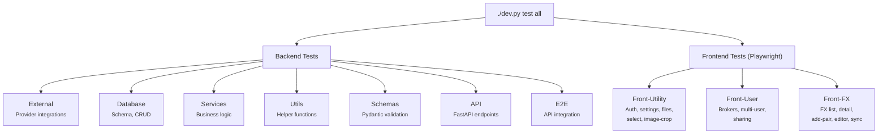

# 🧪 Test Walkthrough

This section guides you through the LibreFolio test suite. Understanding the tests is one of the best ways to understand the codebase.

## 🚀 Running Tests

All tests are executed through `dev.py`:

```bash
# Run everything
./dev.py test all

# Run a single category
./dev.py test api all

# Run a specific test file
./dev.py test api test_auth_api

# List available tests (without running them)
./dev.py test api --list
```

### 🌐 Global Flags

| Flag | Description |
|------|-------------|
| `--verbose` / `-v` | Show full pytest output |
| `--coverage` | Run with code coverage tracking |
| `--cov-clean` | Clean coverage database before run |
| `--db-reset` | Reset test database before DB tests |

### 🖥️ Frontend Flags

Frontend test categories support additional flags (`--headed`, `--debug`, `--ui`). See the [Frontend Tests Overview](front-overview.md) for details.

---

## 📋 Test Categories

LibreFolio organizes tests into **10 categories**, grouped by layer:

| Category | Command | What It Tests |
|----------|---------|---------------|
| **External** | `./dev.py test external all` | Provider integrations (FX, assets, BRIM) — no server needed |
| **Database** | `./dev.py test db all` | SQLite schema, migrations, CRUD — no server needed |
| **Services** | `./dev.py test services all` | Business logic in the service layer |
| **Utils** | `./dev.py test utils all` | Helper functions and utility modules |
| **Schemas** | `./dev.py test schemas all` | Pydantic model validation |
| **API** | `./dev.py test api all` | FastAPI endpoints (auto-starts server) |
| **E2E** | `./dev.py test e2e all` | Backend end-to-end with API interaction |
| **Front-Utility** | `./dev.py test front-utility all` | Auth, settings, files, select, image-crop (Playwright) |
| **Front-User** | `./dev.py test front-user all` | Brokers, multi-user, sharing (Playwright) |
| **Front-FX** | `./dev.py test front-fx all` | FX list, detail, add-pair, editor, sync (Playwright) |

---

## 🏗️ Architecture Overview



---

## 📑 Category Details

### 🔧 Backend Categories

- **[External](external.md)** — Tests that call real external APIs (FX providers, asset providers, BRIM parsers). Run without the backend server.
- **[Database](db.md)** — Tests the database layer directly (schema validation, persistence, migrations). Uses an isolated test SQLite file.
- **[Services](services.md)** — Tests the service layer business logic, often with mocked dependencies.
- **[Utils](utils.md)** — Tests utility modules and helper functions.
- **[Schemas](schemas.md)** — Tests Pydantic model validation, serialization, and edge cases.
- **[API](api.md)** — Integration tests for FastAPI endpoints. Automatically starts a test server if needed.
- **[E2E](e2e.md)** — End-to-end backend tests with real API interaction and database state.

### 🎭 Frontend Categories (Playwright)

- **[Front-Utility](front-utility.md)** — Tests UI components: authentication flow, settings tabs, file upload, search selects, image cropping.
- **[Front-User](front-user.md)** — Tests user-facing features: broker CRUD, multi-user scenarios, broker sharing with RBAC.
- **[Front-FX](front-fx.md)** — Tests the FX module: pair list, detail chart, add-pair modal, data editor, sync, and FX-specific API calls.

!!! info "Frontend tests require a running server"

    Frontend categories automatically start both the backend server and serve the frontend build. Use `--headed` to watch the browser in action.

---

## 📊 Coverage

Generate a code coverage report:

```bash
./dev.py test all --coverage
```

This generates an HTML report in `htmlcov/index.html` showing which lines of code are covered by tests.
