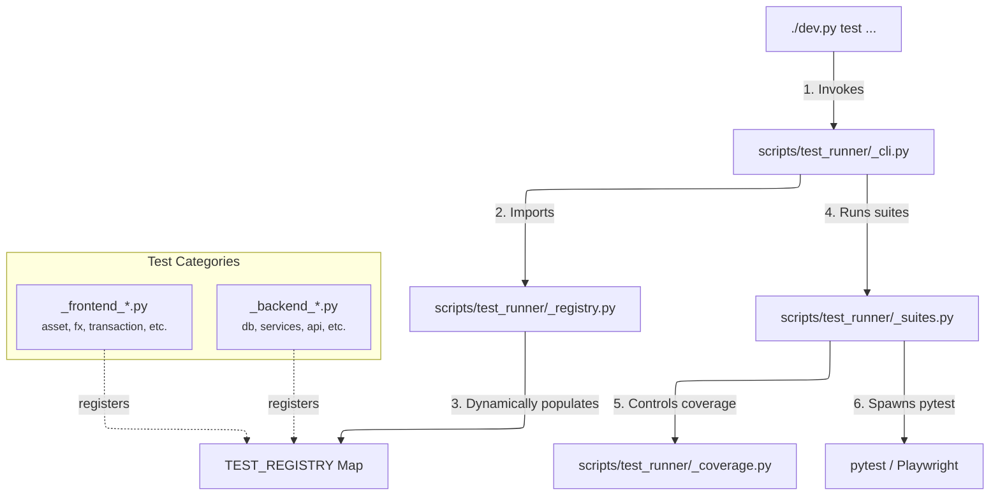
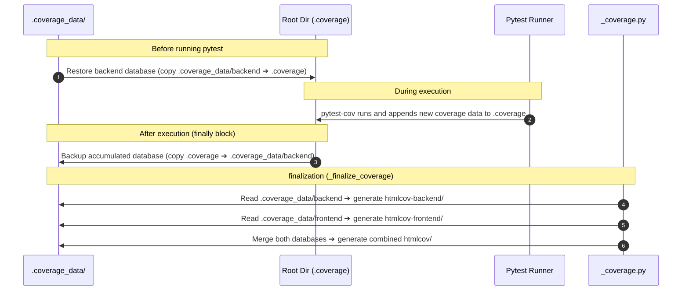

# 🏗️ Test Runner Architecture

This document describes the design and inner workings of the modular test orchestrator located in `scripts/test_runner/`.

---

## 🏗️ Architecture Overview

LibreFolio orchestrates its test execution through a custom Python package rather than relying on a static, monolithic script. This modular structure separates command-line parsing, test suites definitions, and coverage reporting from individual test module logic.



---

## 🗃️ Dynamic Registry Pattern (`_registry.py`)

To prevent the orchestrator from needing hardcoded knowledge of every single test action, the runner utilizes a **Dynamic Registry Pattern**. 

1. **Central Store:** `scripts/test_runner/_registry.py` defines a global `TEST_REGISTRY` dictionary.
2. **Registration Hooks:** Each test category module (e.g., `_backend_utils.py`, `_frontend_fx.py`) implements a `populate_registry(registry: dict)` function.
3. **Execution Mapping:** When the orchestrator starts, it calls the populate functions in order. Each category registers its commands and sub-test functions:

```python
# Example from scripts/test_runner/_backend_utils.py
def populate_registry(registry: dict) -> None:
    cat = make_category(
        help_text="Utility module tests (decimal, datetime, geo, currency, cache)",
        description="Utility Module Tests..."
    )
    # Register actions
    add_test(cat, "decimal-precision", utils_decimal_precision, name="Decimal Precision", desc="...")
    add_test(cat, "all", utils_all, test_names=False, name="All Utils Tests", desc="...")
    
    registry["utils"] = cat
```

### Registry Entry Shape

A category registered in `TEST_REGISTRY` maps to a dictionary containing:
* `_meta`: General information about the category (used for `--help` texts).
* A set of actions (e.g., `"decimal-precision"`, `"all"`), where each action points to:
  * `func`: The Python callable that starts the test.
  * `name`: A human-readable title.
  * `desc`: A short description of the test action.
  * `prereq` / `tests` / `note`: Optional flags and metadata for dependencies.

---

## 📊 Coverage Isolation & Swap Pipeline (`_coverage.py`)

Because backend and frontend tests run in different modes (some as direct test scripts, others as separate server subprocesses driven by Playwright E2E tests), they write coverage reports using `parallel = true`. 

By default, running `coverage combine` would merge and delete all coverage databases. To prevent backend and frontend reports from colliding, the test runner implements a **swap-in/swap-out** pipeline:



### Coverage File Invariants
* `.coverage`: Active working copy. Stored in the root folder, updated during pytest runs, and combined dynamically.
* `.coverage_data/backend`: Accumulated backend test coverage. Persisted here between backend test runs.
* `.coverage_data/frontend`: Subprocess coverage captured from the backend server while running Playwright E2E tests.

---

## 📂 Submodule Directory Map

| File | Purpose |
|------|---------|
| [`__init__.py`](file:///Users/ea_enel/Documents/00_My/LibreFolio/scripts/test_runner/__init__.py) | Package entry point. Exports the CLI dispatchers and registers system-wide path overrides. |
| [`_cli.py`](file:///Users/ea_enel/Documents/00_My/LibreFolio/scripts/test_runner/_cli.py) | Defines the argparse command hierarchy (e.g., `./dev.py test [category] [action]`), listings (`--list`), and executes the matched callback. |
| [`_registry.py`](file:///Users/ea_enel/Documents/00_My/LibreFolio/scripts/test_runner/_registry.py) | Imports and invokes the registry population hook for all modules to assemble `TEST_REGISTRY`. |
| [`_suites.py`](file:///Users/ea_enel/Documents/00_My/LibreFolio/scripts/test_runner/_suites.py) | Contains logic to run entire groups of tests (`all`, `all-backend`, `all-frontend`) and clean up coverage folders. |
| [`_coverage.py`](file:///Users/ea_enel/Documents/00_My/LibreFolio/scripts/test_runner/_coverage.py) | Implements database merging, report generation (`htmlcov-backend/`, `htmlcov-frontend/`, `htmlcov/`), and HTML viewer serving. |
| [`_common.py`](file:///Users/ea_enel/Documents/00_My/LibreFolio/scripts/test_runner/_common.py) | Shared testing helpers: spawning backend servers, waiting for ports, checking database states, and executing test subprocess commands. |
| `_backend_*.py` | Specific modules for launching pytest categories on the backend. |
| `_frontend_*.py` | Specific modules for running Playwright E2E testing files on the frontend SPA. |

---

## 🛠️ Developer Guide: Adding a Test Action

To add a new test action to an existing category:

1. Open the category module (e.g., `_backend_utils.py` for utility tests).
2. Write a function that executes your test suite using the shared runner helpers:
   ```python
   def utils_my_new_utility(verbose: bool = False) -> bool:
       """Run tests for the new utility helper."""
       # Run command returns True on success
       return run_command(
           cmd=["pytest", "backend/test_scripts/test_utilities/test_my_new_utility.py"],
           verbose=verbose
       )
   ```
3. Locate the `populate_registry` function at the bottom of the file and register your action:
   ```python
   add_test(cat, "my-new-utility", utils_my_new_utility, name="My New Utility", desc="Tests my new utility module")
   ```
4. Once registered, it is automatically exposed in the CLI:
   ```bash
   ./dev.py test utils my-new-utility
   ```

---

## 🔗 Related

* 🧪 **[Test Walkthrough Overview](index.md)** — Listing of test commands and categories.
* 🖥️ **[Frontend E2E Tests Overview](front-overview.md)** — Guide to running Playwright E2E suites.
* 📦 **[dev.py Installation Guide](../dev-installation.md)** — Command catalog for `dev.py`.
