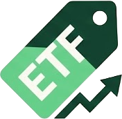

# 📊 Tipi di Asset

LibreFolio supporta un'ampia gamma di classi di asset per coprire un portafoglio diversificato. Ogni tipo di asset ha comportamenti specifici per quanto riguarda prezzi, dividendi e gestione fiscale.

## 📋 Asset Supportati

| | Tipo | Codice | Descrizione | |
|:---:|:---|:---|---|:---:|
| {: width="32" } | **Azioni** | `STOCK` | Quote di partecipazione in una società. I prezzi vengono generalmente recuperati da borse pubbliche. | [📖](stocks.md) |
| {: width="32" } | **ETF** | `ETF` | Fondi negoziati in borsa. Panieri di titoli che vengono scambiati come azioni. | [📖](etfs.md) |
| {: width="32" } | **Obbligazioni** | `BOND` | Titoli a reddito fisso che rappresentano un prestito a un mutuatario (governativo o societario). | [📖](bonds.md) |
| {: width="32" } | **Crypto** | `CRYPTO` | Valute digitali e token (Bitcoin, Ethereum, ecc.). | [📖](crypto.md) |
| {: width="32" } | **P2P / Crowdfunding** | `CROWDFUND` | Prestiti peer-to-peer o crowdfunding immobiliare. Spesso valutati tramite pagamenti di interessi programmati. | [📖](real-estate.md) |
| {: width="32" } | **Fondo Comune d'Investimento** | `FUND` | Fondi di investimento gestiti professionalmente. | [📖](mutual-fund.md) |
| {: width="32" } | **Materie Prime** | `HOLD` | Asset fisici come Oro, Argento o Diamanti detenuti per il loro valore a lungo termine. | [📖](commodities.md) |
| {: width="32" } | **Altro** | `OTHER` | Qualsiasi altra classe di asset (es. Arte, Private Equity, Oggetti da Collezione). | [📖](other.md) |
| {: width="32" } | **Indice &amp; Benchmark** | `—` | Indici di mercato (S&amp;P 500, MSCI World) utilizzati come benchmark di riferimento — non direttamente negoziabili. | [📖](index-benchmark.md) |

---

## 🔗 Correlati

- 💸 **[Tipi di Transazione](../transaction-types/index.md)** — Operazioni che influenzano il tuo portafoglio
- 📅 **[Eventi sugli Asset](../asset-events/index.md)** — Azioni societarie che influenzano i prezzi degli asset
- 💰 **[Tassazione](../../fundamentals/taxation.md)** — Implicazioni fiscali per classe di asset
