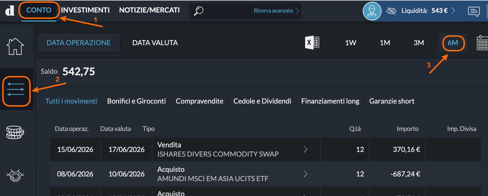
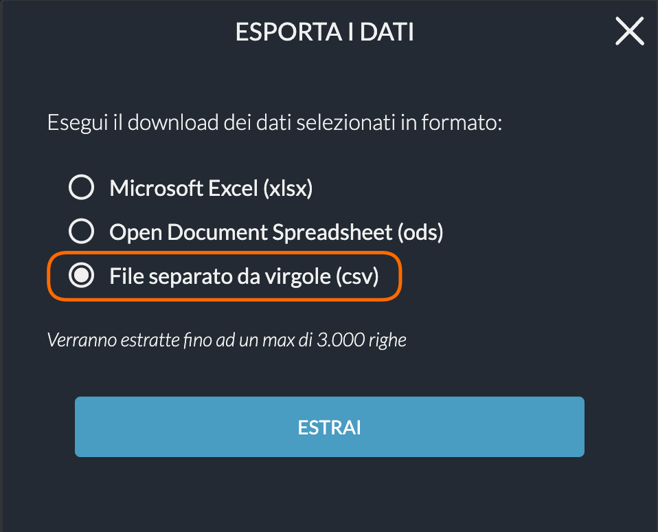

#  Directa SIM

!!! info "Beta"

    Questo plugin è in **Beta** — testato con file di esempio, ma potrebbero esistere casi limite.

## 📥 Come Esportare

LibreFolio supporta il formato **CSV** esportato da Directa SIM. Gli screenshot qui sotto sono da desktop, ma i passaggi sono simili anche da mobile.

### Passo 1 — Apri la lista movimenti

Accedi a [Directa](https://www.directatrading.com) e clicca sulla scheda **CONTO** (❶). Poi clicca sull'icona filtro/movimenti a sinistra (❷) e seleziona il periodo di tempo desiderato — es. **6M** (❸).

{ style="border-radius: 8px; box-shadow: 0 4px 16px rgba(0,0,0,0.15);" }

### Passo 2 — Esporta in CSV

Clicca sull'icona di esportazione (l'icona del foglio di calcolo con la **X** verde) in cima alla tabella. Nella finestra che si apre, seleziona **File separato da virgole (csv)** e clicca su **ESTRAI**.

{ style="border-radius: 8px; box-shadow: 0 4px 16px rgba(0,0,0,0.15);" }

Salva il file senza aprirlo o modificarlo in Excel, poi importalo in LibreFolio.

## 📝 Note

- Supporta operazioni su azioni, obbligazioni ed ETF, dividendi, tasse (ritenute fiscali) e commissioni di transazione.
- È supportato solo il formato **CSV** — non xlsx né ods.
- Le operazioni del conto sono denominate in EUR.
- L'esportazione copre fino a 3.000 righe per file. Per storici più lunghi, esporta più periodi e importali in sequenza.

